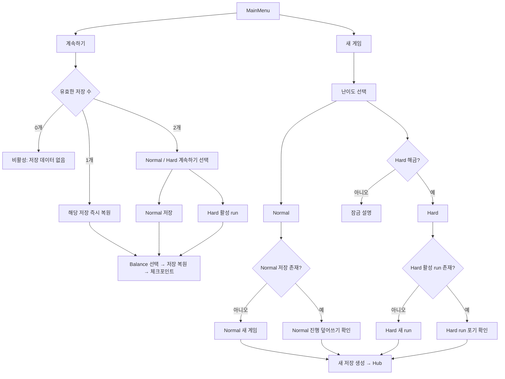

# Necrocis 저장·난이도 시스템 설계서

- 문서 상태: 확정본 / 1차 구현 반영
- 작성일: 2026-07-28
- 마지막 갱신: 2026-07-29
- 기준 커밋: `a449f600a026d2f47c204cf4b9cdb44b9ce8da42`
- 관련 문서: `SYSTEM_AUDIT_REPORT_2026-07-28.md`
- 구현 상태: 저장·세션·메인 메뉴·일시정지 UI와 난이도별 핵심 Balance Profile을 구현했다. 최종 보스 콘텐츠는 아직 없으므로 클리어 저장 API 연결 지점만 준비되어 있다.

---

## 1. 문서 목적

이 문서는 다음 기능을 실제로 구현하기 전에 게임 규칙, 저장 데이터, 난이도 분리 방식, UI 흐름과 예외 상황을 먼저 확정하기 위한 설계 기준이다.

1. Normal 난이도는 최종 보스 클리어 전까지 플레이어 성장을 유지한다.
2. Normal에서 사망하면 Hub로 돌아가고 레벨과 보스 클리어 상태를 유지한다.
3. Hard 난이도는 한 번의 run 단위로 동작한다.
4. Hard에서 사망하면 레벨과 Hard run의 보스 클리어 상태를 모두 초기화하고 메인 화면으로 돌아간다.
5. Hard는 Normal 최종 클리어 후 해금한다.
6. 메인 화면에 저장 데이터를 불러오는 `계속하기`와 난이도를 선택해 새로 시작하는 `새 게임`을 제공한다.
7. Normal과 Hard의 밸런스 수치를 서로 독립적으로 조정할 수 있게 한다.
8. 설정 화면의 보스 진행도 초기화 기능은 제거하는 방향으로 설계한다.
9. 게임 종료 후 재실행 시 어느 위치에서 재개할지는 구현 전에 정책을 결정한다.

이 문서에서 **확정**은 현재 요청으로 결정된 규칙, **권장안**은 현재 코드 구조를 고려한 제안, **결정 필요**는 구현 전에 사용자가 선택해야 하는 항목을 의미한다.

---

## 2. 설계 당시 코드 상태

이 절은 구현 전 전수조사에서 확인한 기준 상태를 보존한 기록이다. 현재 구현 결과는 `18. 구현 반영 상태`를 기준으로 판단한다.

### 2.1 난이도

현재 `GameDifficulty`에는 `Normal`만 있다.

```csharp
public enum GameDifficulty
{
    Normal = 0
}
```

`GameManager`에는 `currentDifficulty`와 `IsNormalDifficulty`가 있지만 런타임에서 난이도를 선택하거나 변경하는 공개 API가 없다. Hard 데이터나 Hard 전용 진행 상태도 없다.

### 2.2 현재 진행 데이터 소유 위치

| 데이터 | 현재 소유자 | 현재 저장 |
|---|---|---|
| 레벨 | `LevelUpManager` static 필드 | 저장 안 함 |
| 경험치 | `LevelUpManager` static 필드 | 저장 안 함 |
| 직업 | `LevelUpManager` static 필드 | 저장 안 함 |
| 레벨업 선택 기록 | `LevelUpManager` static List | 저장 안 함 |
| 실제 스탯 수정자 | `CharacterStats` List | 저장 안 함 |
| 현재 HP | `CharacterStats` | 저장 안 함 |
| 아이템 | `PlayerItemManager` List | 저장 안 함 |
| 보스 클리어 | `BossProgress` PlayerPrefs | 저장함 |
| 바이옴 진입 횟수 | `GameManager` | 저장 안 함 |
| 바이옴 랜덤 시드 | `BiomeManager` static Dictionary | 저장 안 함 |
| 설정·입력 | PlayerPrefs | 저장함 |

진행 상태가 여러 static 클래스, MonoBehaviour와 PlayerPrefs에 흩어져 있다. 저장 시스템을 추가할 때 이 상태를 각각 직접 파일에 쓰는 방식보다, `SaveService`가 각 시스템의 상태를 수집하고 복원하도록 명확한 경계를 두어야 한다.

### 2.3 현재 사망

현재 사망 화면에서 Hub 귀환을 선택하면:

1. 플레이어를 부활 가능 상태로 변경
2. HP를 최대로 회복
3. `GameManager.ReturnToHub()`
4. `SceneLoader.ReturnToHub()`
5. Hub 고정 위치로 스폰

을 수행한다. 플레이어 오브젝트는 파괴되지 않으므로 같은 실행 세션에서는 레벨, 직업, 스탯과 아이템도 그대로 남는다.

### 2.4 현재 보스 진행

네 장기 보스 클리어는 다음 PlayerPrefs 키로 저장된다.

- `necrocis.boss-defeated.intestine`
- `necrocis.boss-defeated.liver`
- `necrocis.boss-defeated.stomach`
- `necrocis.boss-defeated.lung`

현재 구조는 난이도 구분이 없다. 그대로 Hard를 추가하면 Hard 보스 클리어가 Normal 진행과 섞이거나, Normal에서 잡은 보스가 Hard에서도 잡힌 상태가 될 수 있다.

### 2.5 현재 밸런스 데이터

밸런스 수치는 다음 위치에 분산되어 있다.

- `LevelProgressionConfig.asset`
- Hub 씬의 `PlayerController`, `PlayerAttack`, `PlayerClassSkillController`
- 네 바이옴의 `BiomeConfig`
- `EnemySpawnConfig`
- `BossArenaConfig`
- 보스 패턴 컴포넌트의 직렬화 필드
- `PlayerItemCombatEffects`의 다수 직렬화 필드
- `EliteSpawner`
- 월드 아이템 스포너

Hard를 단순히 “적 HP 2배” 같은 전역 배율 하나로 구현하면 경험치, 스킬, 보스 패턴, 아이템, 스폰 밀도를 독립적으로 조정할 수 없다.

---

## 3. 게임 규칙

### 3.1 Normal 난이도

#### 확정

- 처음부터 선택 가능하다.
- 플레이어 레벨을 저장하고 유지한다.
- 장·간·위·폐 보스 클리어 상태를 저장하고 유지한다.
- 사망하면 Hub로 돌아간다.
- 사망해도 저장된 레벨과 보스 클리어 상태는 초기화하지 않는다.
- Normal 최종 보스 클리어 시 Hard가 해금된다.
- Hard 해금 후에도 `새 게임 > Normal`을 선택하여 Normal을 처음부터 다시 플레이할 수 있다.
- Hard 해금은 Profile에 유지되므로 새 Normal을 시작해도 다시 잠기지 않는다.

#### 확정 세부 규칙

- 경험치와 직업도 레벨의 일부로 간주하여 저장한다.
- 레벨업으로 획득한 영구 스탯도 저장한다.
- 보유 아이템도 저장한다.
- 사망 시 현재 방식대로 HP를 최대로 회복한다.
- 사망 시 짧은 버프, DOT, 쿨다운, 소환수의 임시 상태는 초기화한다.
- 최종 보스를 클리어해도 Normal 저장 파일은 즉시 삭제하지 않는다.
- 완료된 Normal 파일에는 `campaignCompleted = true`를 기록한다.
- 완료된 Normal도 `계속하기`로 다시 플레이할 수 있다.
- 완료된 Normal은 읽기 전용으로 잠그지 않는다.
- 완료 여부와 무관하게 `새 게임 > Normal`을 선택할 수 있으며, 확인 후 기존 Normal 진행만 초기화하여 처음부터 다시 시작할 수 있다.

레벨만 저장하고 직업·스탯 선택을 저장하지 않으면 같은 레벨인데 실제 능력치와 스킬이 사라지는 불완전한 복원이 된다. 아이템은 현재 사망 후에도 유지되므로 앱 재실행에서도 유지하는 편이 기존 플레이 감각과 일치한다.

### 3.2 Hard 난이도

#### 확정

- Normal 최종 보스 클리어 후 해금된다.
- Normal과 독립된 밸런스를 사용한다.
- Hard에서 사망하면 레벨을 유지하지 않는다.
- Hard에서 사망하면 해당 run에서 몇 명의 보스를 잡았는지와 무관하게 처음 상태로 돌아간다.
- Hard에서 사망하면 아이템과 아이템별 누적·쿨다운 상태도 전부 제거한다.
- Hard에서 사망 처리가 완료되면 Hub가 아니라 메인 화면으로 돌아간다.
- Normal 보스 진행과 Hard run 보스 진행은 서로 영향을 주지 않는다.

#### 확정 세부 규칙

- Hard는 `HardRunSave` 하나를 갖는 run 기반 모드로 정의한다.
- 살아 있는 동안에는 레벨, 경험치, 직업, 스탯, 아이템과 Hard 보스 클리어 상태를 run 데이터로 유지한다.
- 게임을 정상 종료했다가 `계속하기`로 재개하는 경우에는 살아 있던 같은 run이므로 아이템도 복원한다.
- 사망 순간 `HardRunSave`를 활성 run이 없는 빈 상태로 교체한다.
- 사망한 Hard run에서는 레벨, 경험치, 직업, 영구 스탯, 아이템, 보스 진행, 시드와 체크포인트를 하나도 다음 run으로 승계하지 않는다.
- Hard 초기화는 Normal 저장과 Hard 해금 플래그를 건드리지 않는다.
- 메인 화면에서 Hard를 다시 선택하면 새 run ID와 새 시드로 레벨 1 run을 생성한다.
- Hard 최종 보스를 클리어하면 해당 run을 완료 상태로 기록한 뒤 다음 Hard 시작은 새 run으로 시작한다.
- 향후 최고 기록, 클리어 횟수, 최단 시간 등을 추가하더라도 이는 `ProfileSave`의 통계로 분리한다.

### 3.3 난이도별 데이터 격리 원칙

| 데이터 | Normal | Hard |
|---|---|---|
| 해금 여부 | 항상 가능 | Profile의 해금 플래그 |
| 레벨/경험치 | 영구 캠페인 저장 | 살아 있는 run 동안만 |
| 직업/스탯 | 영구 캠페인 저장 | 살아 있는 run 동안만 |
| 아이템 | 영구 캠페인 저장 권장 | 살아 있는 run 동안만 |
| 장기 보스 | 영구 저장 | run 내부 저장 |
| 최종 보스 클리어 | Profile에 Normal 완료 기록 | Hard 통계로 분리 가능 |
| 사망 | 진행 유지, Hub 귀환 | run 전체 초기화, MainMenu 귀환 |
| 밸런스 | Normal 전용 Profile | Hard 전용 Profile |
| 메인 메뉴 보스 공개 이미지 | Normal 진행만 반영 | 영향 없음 |

메인 메뉴의 보스 실루엣은 Normal 캠페인 수집 상태만 참조해야 한다. Hard run을 시작하거나 Hard에서 보스를 잡았다고 메인 메뉴 아트가 새로 열리거나 잠기면 안 된다.

### 3.4 메인 화면 보스 공개 동작의 현재 구현 확인

2026-07-29 현재 코드와 Unity 실행 결과를 확인했다.

1. `MidBossArenaController`가 보스 처치 완료 시 `GameManager.CollectRelic(biome)`을 호출한다.
2. `GameManager.CollectRelic`이 `BossProgress.MarkDefeated(biome)`을 호출한다.
3. `BossProgress`가 활성 run의 보스 상태를 갱신하고, Normal 처치라면 Profile의 `bossDiscoveries`도 영구 갱신한다.
4. `MainMenuController.CreateBossSilhouette`는 Profile에서 공개된 바이옴이면 해당 실루엣 오버레이를 생성하지 않는다.
5. 따라서 배경의 컨셉 아트는 그대로 드러나고, 아직 잡지 않은 보스 위치에만 검은 실루엣이 남는다.

Unity 6000.3.9f1에서 다음 두 상태를 실행하고 캡처를 직접 확인했다.

- 부분 클리어: Lung 플래그만 설정했을 때 Lung 컨셉 아트만 공개되고 나머지 세 실루엣은 유지됨
- 전체 클리어: 네 실루엣이 모두 사라지고 네 컨셉 아트가 모두 공개됨

기존 `PlayerPrefs` 값은 최초 로드 때 Profile로 한 번 이관한다. 일반 설정 UI에는 보스 진행도 초기화 기능이 없고, 개발용 초기화 API만 별도로 남긴다.

---

## 4. 저장 데이터 구조

### 4.1 파일 분리

권장 파일 구조:

```text
Application.persistentDataPath/
└── Saves/
    ├── profile.json
    ├── normal.json
    ├── hard-run.json
    ├── profile.backup.json
    ├── normal.backup.json
    └── hard-run.backup.json
```

설정과 입력 리바인딩은 현재처럼 PlayerPrefs에 두어도 된다. 게임 진행은 PlayerPrefs의 여러 개별 키보다 버전이 있는 JSON 파일로 옮기는 것을 권장한다.

### 4.2 `ProfileSave`

난이도와 무관한 계정 수준 상태다.

```csharp
[Serializable]
public sealed class ProfileSave
{
    public int schemaVersion;
    public bool normalCampaignCompleted;
    public bool hardUnlocked;
    public BossDiscoverySave bossDiscoveries;
    public int normalClearCount;
    public int hardClearCount;
    public GameDifficulty lastSelectedDifficulty;
    public GameDifficulty lastPlayedDifficulty;
    public long lastSavedUtcTicks;
}
```

규칙:

- `hardUnlocked`는 Normal 최종 보스 클리어 이벤트에서만 `true`가 된다.
- 일반 플레이에서 다시 `false`로 돌아가지 않는다.
- `bossDiscoveries`는 한 번 공개된 메인 화면 보스 아트를 영구 보존하며 새 Normal 시작으로 초기화하지 않는다.
- 개발 테스트용 강제 해금은 `UNITY_EDITOR` 또는 `DEVELOPMENT_BUILD`에서만 제공한다.
- 장기 보스 네 명만 잡은 상태로는 Hard를 해금하지 않는다.
- `lastPlayedDifficulty`는 메인 화면 `계속하기`의 우선 대상을 정할 때 사용한다.

최종 보스가 아직 없기 때문에 첫 구현 시 Hard는 정상 플레이로 해금할 수 없다. 이것은 버그가 아니라 콘텐츠 의존 상태다. 최종 보스 이벤트를 연결할 때 해금되도록 인터페이스만 먼저 준비한다.

### 4.3 `NormalSave`

```csharp
[Serializable]
public sealed class NormalSave
{
    public int schemaVersion;
    public string saveId;
    public bool campaignStarted;
    public bool campaignCompleted;

    public PlayerProgressSave player;
    public BossProgressSave bosses;
    public ResumeCheckpointSave checkpoint;
    public WorldRunSave world;

    public long playTimeSeconds;
    public long lastSavedUtcTicks;
}
```

Normal은 한 개 슬롯으로 확정한다. 다중 슬롯은 UI와 테스트 범위를 크게 늘리므로 실제 요구가 생길 때 별도 기능으로 추가한다.

### 4.4 `HardRunSave`

```csharp
[Serializable]
public sealed class HardRunSave
{
    public int schemaVersion;
    public string runId;
    public bool isActive;
    public bool isCompleted;

    public PlayerProgressSave player;
    public BossProgressSave bossesClearedThisRun;
    public ResumeCheckpointSave checkpoint;
    public WorldRunSave world;

    public long runStartedUtcTicks;
    public long runPlayTimeSeconds;
    public long lastSavedUtcTicks;
}
```

Hard 사망 초기화는 파일을 단순 삭제하기보다 `isActive = false`인 빈 `HardRunSave`를 원자적으로 저장하는 편이 안전하다. 삭제 중 앱이 종료되면 이전 파일이 남아 run이 되살아나는 문제를 줄일 수 있다.

### 4.5 플레이어 진행 DTO

```csharp
[Serializable]
public sealed class PlayerProgressSave
{
    public int level;
    public int currentExp;
    public JobType job;
    public float currentHealth;

    public List<SavedLevelUpModifier> levelUpModifiers;
    public List<LevelUpStatChoice> selectionHistory;
    public List<SavedItemState> items;
}
```

`CharacterStats.CreateSnapshot()`의 최종 수치만 저장하는 방식은 권장하지 않는다. 최종 수치는 기본 스탯, 레벨업, 아이템, 임시 버프가 모두 섞인 결과이기 때문이다.

복원 가능한 원인 데이터를 저장해야 한다.

- 기본 스탯: 선택한 난이도의 밸런스 Profile에서 읽음
- 레벨업 영구 강화: `SavedLevelUpModifier`
- 아이템: `SavedItemState` 목록
- 임시 버프: 저장하지 않음
- 현재 HP: 별도 값

### 4.6 레벨업 수정자 DTO

```csharp
[Serializable]
public sealed class SavedLevelUpModifier
{
    public CharacterStatType statType;
    public CharacterStatModifierMode mode;
    public float resolvedValue;
    public string reason;
}
```

일반 레벨업 선택은 현재 밸런스 설정에서 값이 결정되지만, `bio_gamble`처럼 무작위 결과가 있는 경우 실제 나온 값인 `resolvedValue`를 저장해야 한다. 로드 때 다시 추첨하면 저장 전후 스탯이 달라진다.

`selectionHistory`도 별도로 저장해야 직업별 레벨업 선택 가중치가 재실행 후 유지된다.

### 4.7 아이템 상태 DTO

아이템 ID만 저장하면 고정 효과는 복원할 수 있지만 장기 누적 및 1회성 상태는 사라진다.

현재 코드에서 별도 저장 검토가 필요한 대표 상태:

- `blood_contract`의 다음 강화까지 남은 처치 수
- `blood_contract`로 영구 획득한 최대 HP 횟수
- `split_regeneration`의 부활 사용 여부
- `decay_organ`의 누적 활성 플레이 시간
- `platelet_membrane`의 현재 보호막과 다음 충전까지 남은 시간
- `recovery_factor`의 다음 회복까지 남은 시간

권장 DTO:

```csharp
[Serializable]
public sealed class SavedItemState
{
    public string itemId;
    public List<SavedItemStateValue> persistentValues;
}

[Serializable]
public sealed class SavedItemStateValue
{
    public string key;
    public int intValue;
    public float floatValue;
    public bool boolValue;
}
```

문자열 key가 무제한으로 늘어나지 않도록 각 아이템 구현이 지원 key를 상수로 정의하고 검증해야 한다. 더 강한 타입 안정성이 필요하면 상태가 필요한 아이템만 별도 DTO로 만들어도 된다.

아이템 상태 분류 원칙:

| 분류 | 예 | 저장 |
|---|---|---|
| 획득으로 결정되는 고정 효과 | 금단 성장, 외골격 | item ID로 재구성 |
| run 동안 누적되는 영구 효과 | 피의 계약 최대 HP | 저장 |
| 한 번 사용하면 돌아오지 않는 자원 | 분열 재생 사용 여부 | 저장 |
| 실제 플레이 시간 누적 | 부패 장기 | 누적 초를 저장, 오프라인 시간은 더하지 않음 |
| 긴 방어 자원 | 혈소판 보호막 | 현재량과 남은 충전시간 저장 권장 |
| 몇 초짜리 전투 버프 | 대식 세포 스택, 절단 반사 | 저장하지 않음 |
| 대상별 전투 상태 | 생체 공명 대상 스택 | 저장하지 않음 |
| 소환수 위치·공격 쿨다운 | 드론, 포자, 수호 장기 | 저장하지 않고 재생성 |

복원 순서에서 먼저 item ID로 고정 효과를 구성하고, 그 다음 persistent value를 적용한다. 피의 계약으로 얻은 최대 HP처럼 아이템 ID만으로 복원되지 않는 영구 수정자는 아이템 상태에서 정확한 누적 횟수를 복구해야 한다.

### 4.8 보스 진행 DTO

```csharp
[Serializable]
public sealed class BossProgressSave
{
    public bool intestineDefeated;
    public bool liverDefeated;
    public bool stomachDefeated;
    public bool lungDefeated;
    public bool finalBossDefeated;
}
```

동일 구조를 Normal과 Hard가 각각 소유하되 의미는 다르다.

- Normal: 캠페인 영구 진행
- Hard: 현재 run의 진행

`BossProgress`는 활성 난이도에 따라 `SaveService`의 run 보스 상태를 읽는다.

메인 메뉴 아트는 활성 run이 아니라 Profile의 영구 `bossDiscoveries`를 읽는다.

### 4.9 월드 상태

```csharp
[Serializable]
public sealed class WorldRunSave
{
    public int intestineSeed;
    public int liverSeed;
    public int stomachSeed;
    public int lungSeed;

    public int intestineEntryCount;
    public int liverEntryCount;
    public int stomachEntryCount;
    public int lungEntryCount;
}
```

같은 run에서 바이옴을 재진입할 때 같은 지형을 유지하려면 현재 static 시드를 저장 데이터로 옮겨야 한다.

월드 상자, 처치된 일반 적, 떨어진 투사체, 현재 청크의 모든 GameObject 상태까지 저장하는 것은 1차 범위에 포함하지 않는다. 정확한 위치 재개를 어렵게 만드는 핵심 이유다.

---

## 5. 저장 시점

### 5.1 즉시 저장해야 하는 이벤트

- Normal 장기 보스 클리어
- Normal 최종 보스 클리어 및 Hard 해금
- Hard 보스 클리어
- 플레이어 사망
- 난이도 선택 후 새 게임/run 생성
- 직업 확정
- 아이템 획득·제거
- 씬 전환 시작 또는 완료
- 앱 백그라운드 전환
- 정상 종료

보스 클리어와 Hard 사망은 다른 이벤트보다 우선순위가 높다. 이 두 이벤트는 지연 저장 큐를 기다리지 않고 즉시 원자적 저장을 수행해야 한다.

### 5.2 지연 저장 가능한 이벤트

- 경험치 획득
- 일반 레벨업
- 현재 HP 변경
- 플레이 시간 증가

위 이벤트마다 디스크를 즉시 쓰면 전투 중 I/O가 너무 잦아질 수 있다. 메모리의 save model을 즉시 갱신하고 0.5~1초 debounce 후 파일에 반영하는 것을 권장한다.

### 5.3 원자적 저장

권장 순서:

1. 현재 데이터의 유효성 검사
2. `*.tmp` 파일에 JSON 작성
3. 기존 정상 파일을 `*.backup.json`으로 교체
4. temp 파일을 정상 파일명으로 rename
5. 성공 후 dirty flag 해제

로드 순서:

1. 정상 파일 파싱
2. schema 및 값 검증
3. 실패하면 backup 파싱
4. backup도 실패하면 새 데이터 생성
5. 사용자에게 손상 복구 사실을 한 번 알림

체크섬은 우발적 손상 검출에는 도움이 되지만 치트 방지는 아니다. 싱글 플레이 게임이라면 난독화·암호화보다 백업과 스키마 마이그레이션이 우선이다.

---

## 6. 로드 및 복원 순서

현재 `PlayerStats.Awake()`가 기본 스탯을 먼저 적용하고 `LevelUpManager`는 static 기본값으로 시작한다. 저장 복원을 중간에 덧붙이면 UI 이벤트나 아이템 효과가 두 번 적용될 수 있다.

권장 로드 순서:

1. `SaveService`가 Profile과 선택한 난이도 save를 읽음
2. `DifficultyService`가 Normal/Hard Balance Profile을 선택
3. Hub의 지속 서비스와 플레이어 생성
4. `LevelUpManager.ResetRuntimeState()`
5. 기본 스탯을 선택한 난이도 Profile로 구성
6. 레벨, 경험치, 직업 복원
7. 레벨업 영구 수정자를 순서대로 복원
8. 아이템 ID를 알림 없는 획득 API로 복원
9. 아이템의 장기 누적·소모 상태 복원
10. 현재 HP 복원
11. 해당 난이도의 보스 진행 복원
12. 바이옴 시드와 진입 횟수 복원
13. UI에 “전체 상태 복원 완료” 이벤트 한 번 발생
14. 저장된 논리 체크포인트로 이동

복원 중에는 일반 획득 사운드, 획득 팝업, 자동 저장을 잠시 억제해야 한다. 그렇지 않으면 로드하면서 아이템 획득 알림이 세 번 뜨고, 불완전하게 복원된 중간 상태가 저장될 수 있다.

권장 API:

```csharp
public interface ISaveParticipant
{
    void Capture(SaveWriteContext context);
    void Restore(SaveReadContext context);
    void ResetForNewRun(GameDifficulty difficulty);
}
```

모든 MonoBehaviour가 직접 파일을 열게 하지 않고 `SaveService`만 디스크를 담당한다.

---

## 7. 사망 처리

### 7.1 Normal 사망

확정 처리 순서:

1. 사망 UI 표시
2. Normal 진행 데이터의 레벨·경험치·직업·스탯·아이템 유지
3. 현재 체크포인트를 Hub로 변경
4. HP를 최대치로 변경
5. 임시 상태효과와 쿨다운 초기화
6. 즉시 저장
7. Hub 로드 및 지정 스폰 위치 배치

Normal 보스 진행은 변경하지 않는다.

### 7.2 Hard 사망

확정 처리 순서:

1. 사망 판정 고정
2. 진행 중인 지연 저장 취소
3. `HardRunSave`를 `isActive = false`인 빈 데이터로 교체
4. 레벨 1, 경험치 0, 무직, 기본 스탯으로 초기화
5. 아이템과 각 아이템의 영구 누적·사용 여부·쿨다운 상태 전부 제거
6. Hard run 보스 진행 전부 초기화
7. 바이옴 시드와 진입 횟수 제거
8. 저장된 체크포인트 제거
9. 즉시 원자적 저장
10. 활성 gameplay session 종료
11. `Time.timeScale`과 입력 차단 상태 정상화
12. session 전용 지속 객체 정리
13. MainMenu 씬 로드

중요한 점은 메인 화면을 먼저 로드한 뒤 초기화하는 것이 아니라, **Hard save 초기화를 먼저 성공시키고 MainMenu로 이동하는 것**이다. 앱이 씬 전환 중 강제 종료되어도 죽기 전 run이 되살아나지 않아야 한다.

현재 플레이어, 카메라, HUD와 여러 매니저는 `DontDestroyOnLoad`를 사용한다. MainMenu만 로드하면 이전 Hard 플레이어가 백그라운드에 남을 수 있으므로 `GameSessionService.EndSession()` 같은 명시적 정리가 필요하다.

메인 화면에도 남겨야 하는 전역 서비스:

- `SaveService`
- `DifficultyService`
- `AudioManager`
- `InputManager`

Hard session 종료 때 제거하거나 초기화할 대상:

- 플레이어와 `PlayerStats`
- 플레이어 아이템 및 상태효과
- gameplay 카메라
- HUD와 레벨업 UI
- 투사체·적·VFX run pool
- 활성 바이옴과 run 전용 이벤트 구독
- `GameManager`의 현재 run 상태

Hard 사망 화면의 기존 `Hub로 돌아가기` 동작은 `메인 화면으로`로 바뀌어야 한다. 사망 연출 후 자동 이동으로 할지, 버튼 확인 후 이동할지는 UI 연출 선택이며 저장 규칙에는 영향을 주지 않는다.

### 7.3 Hard 초기화에 포함되지 않는 것

- `ProfileSave.hardUnlocked`
- Normal 저장
- Normal 보스 진행
- 설정
- 입력 리바인딩
- 향후 추가할 Hard 최고 기록

---

## 8. 메인 화면, 계속하기 및 새 게임 UI

### 8.1 메인 버튼 순서

확정 순서:

1. `계속하기`
2. `새 게임`
3. `설정`
4. `종료`

`계속하기`는 저장된 Normal 캠페인 또는 살아 있는 Hard run을 복원한다. `새 게임`은 난이도 선택 UI를 열어 선택한 난이도의 진행을 새로 만든다.

저장 데이터가 하나도 없을 때도 버튼 위치는 유지하고 `계속하기`를 비활성화한다. 버튼을 숨기면 새 게임의 위치가 저장 유무에 따라 움직이므로 메뉴 조작 일관성이 떨어진다.

### 8.2 전체 흐름



### 8.3 계속하기 대상 판정

Normal이 계속하기 대상이 되는 조건:

- `normal.json` 파싱과 검증 성공
- `campaignStarted == true`
- 플레이어 진행 데이터 존재

Hard가 계속하기 대상이 되는 조건:

- Hard 해금 상태
- `hard-run.json` 파싱과 검증 성공
- `isActive == true`
- 플레이어 진행 데이터 존재

Hard 사망 후 저장되는 `isActive == false` 데이터는 계속하기 대상이 아니다.

대상 선택 규칙:

- 유효 저장이 한 개면 해당 저장을 바로 불러온다.
- Normal과 Hard가 모두 유효하면 작은 선택 모달을 표시한다.
- 선택 모달의 첫 포커스는 `ProfileSave.lastPlayedDifficulty`에 맞춘다.
- `lastPlayedDifficulty`의 저장이 유효하지 않으면 `lastSavedUtcTicks`가 더 최근인 저장을 첫 포커스로 한다.
- 사용자가 선택하기 전에는 어느 저장도 변경하지 않는다.

### 8.4 계속하기 표시 정보

메인 버튼 아래 또는 선택 모달에 다음 요약을 표시할 수 있다.

- 난이도
- 레벨과 직업
- 클리어한 장기 보스 수
- 저장된 논리 위치
- 마지막 저장 시각
- Hard의 경우 `진행 중인 Run`

예:

```text
계속하기
Hard · Lv.14 궁수 · 간 입구 · 보스 2/4
```

저장 요약은 실제 save DTO에서 읽고, 게임 시스템을 미리 생성하지 않는다.

### 8.5 새 게임 난이도 선택

Normal 카드:

- 항상 선택 가능
- 기존 저장 없음: `Normal 시작`
- 기존 저장 있음: `Normal 진행을 새로 시작`
- 기존 레벨과 보스 수를 경고에 표시

Hard 카드:

- Normal 최종 보스 클리어 전에는 잠금
- 설명: `Normal 최종 보스 클리어 후 해금`
- 활성 run 없음: `Hard 새 Run`
- 활성 run 있음: `현재 Hard Run 포기 후 새로 시작`

공통:

- 취소/뒤로가기
- 선택 전 난이도 특징 표시
- 시작 후 난이도 변경 불가
- Hard 잠금 카드를 눌러도 게임이 시작되지 않음

### 8.6 기존 저장 덮어쓰기 확인

`새 게임`은 의도적으로 기존 진행을 초기화할 수 있으므로 확인 단계가 필수다.

Normal 확인 문구 예:

```text
Normal 진행을 새로 시작하시겠습니까?
현재 Lv.18, 보스 3/4 진행이 삭제됩니다.
Hard 해금과 설정은 유지됩니다.
```

Hard 확인 문구 예:

```text
현재 Hard Run을 포기하고 새로 시작하시겠습니까?
현재 Lv.9, 보스 1/4 진행이 삭제됩니다.
Normal 진행과 Hard 해금은 유지됩니다.
```

확인 규칙:

- 기본 포커스는 `취소`
- 확인을 길게 누르거나 2단계 버튼으로 실수 방지
- Normal 새 게임은 `normal.json`만 초기화
- Hard 새 게임은 `hard-run.json`만 초기화
- `ProfileSave`, 설정, 입력 리바인딩은 유지
- 새 저장 생성이 성공한 뒤 Hub를 로드
- 저장 실패 시 기존 진행을 유지하고 메인 화면에 오류 표시

설정 화면의 `보스 진행도 초기화`는 여전히 제거한다. 새 게임은 전체 진행 단위의 명시적인 초기화이고, 설정의 보스 초기화는 일부 데이터만 삭제하는 불완전한 초기화이기 때문이다.

---

## 9. 설정 화면의 초기화 기능

### 9.1 권장 결정

현재 `보스 진행도 초기화` 버튼은 일반 설정에서 제거한다.

이유:

- Hard 해금 조건과 Normal 완료 상태까지 도입되면 “보스만 초기화”가 어떤 데이터를 남겨야 하는지 불명확해진다.
- 레벨은 남고 보스만 잠기는 부분 초기화는 저장 상태를 이해하기 어렵게 만든다.
- 실수로 장기 진행을 삭제할 위험이 있다.
- 음량·화면 설정과 저장 데이터 삭제는 성격이 다르다.

### 9.2 개발용 초기화

개발 중에는 다음 기능이 필요하다.

- Normal 진행 초기화
- Hard 해금
- Hard run 초기화
- 특정 보스 클리어 설정
- 손상 save 생성 테스트

이 기능은 기존 F8 패널처럼 일반 빌드에 항상 포함하지 않고 Editor 메뉴, `UNITY_EDITOR`, 또는 `DEVELOPMENT_BUILD` 전용 디버그 패널로 제한한다.

---

## 10. 난이도별 밸런스 데이터

### 10.1 목표

Normal 수치를 바꿔도 Hard가 자동으로 바뀌지 않고, Hard 수치를 바꿔도 Normal에 영향을 주지 않아야 한다. 단, 스프라이트·오디오·프리팹 같은 콘텐츠 참조는 공유할 수 있다.

“모든 수치”는 sorting order, VFX 수명, 풀 크기 같은 기술 수치가 아니라 **플레이 결과에 영향을 주는 밸런스 수치**로 정의한다.

### 10.2 최상위 구조

```csharp
[CreateAssetMenu]
public sealed class DifficultyDefinition : ScriptableObject
{
    public GameDifficulty difficulty;
    public string displayName;
    public string description;

    public PlayerBalanceConfig player;
    public ProgressionBalanceConfig progression;
    public EnemyBalanceConfig enemies;
    public BossBalanceConfig bosses;
    public ItemBalanceConfig items;
    public WorldBalanceConfig world;
}

[CreateAssetMenu]
public sealed class DifficultyCatalog : ScriptableObject
{
    public DifficultyDefinition normal;
    public DifficultyDefinition hard;
}
```

에셋 예:

```text
Assets/_Project/Data/Difficulty/
├── DifficultyCatalog.asset
├── Normal/
│   ├── NormalDifficulty.asset
│   ├── NormalPlayer.asset
│   ├── NormalProgression.asset
│   ├── NormalEnemies.asset
│   ├── NormalBosses.asset
│   ├── NormalItems.asset
│   └── NormalWorld.asset
└── Hard/
    ├── HardDifficulty.asset
    ├── HardPlayer.asset
    ├── HardProgression.asset
    ├── HardEnemies.asset
    ├── HardBosses.asset
    ├── HardItems.asset
    └── HardWorld.asset
```

### 10.3 `PlayerBalanceConfig`

포함 대상:

- 기본 HP
- 기본 이동속도
- 기본 공격력
- 기본 공격속도
- 기본 공격 사거리
- 기본 마력
- 기본 쿨다운 감소
- Q 공격 크기·사거리·쿨다운
- W 투사체 피해·속도·사거리·쿨다운
- 대시 속도·지속시간·쿨다운·무적 여부
- 피격 무적시간
- 마법사 E/R 전체 수치
- 궁수 E/R 전체 수치
- 전사 E/R 전체 수치

현재 Hub 씬과 코드 기본값에 있는 수치를 이 에셋으로 이동한다. 플레이어 스프라이트, FirePoint Transform과 충돌 LayerMask 같은 구조 참조는 씬/프리팹에 남긴다.

### 10.4 `ProgressionBalanceConfig`

기존 `LevelProgressionConfig`를 난이도별로 분리하거나 그 역할을 흡수한다.

- 최대 레벨
- 필요 경험치 공식
- 적 처치 경험치
- 레벨 구간별 경험치 배율
- 직업 선택 레벨
- E/R 해금 레벨
- 레벨업 스탯 증가량
- 선택지 개수
- `bio_gamble` 범위와 활성 여부

`LevelUpManager.Config`가 고정 Resources 경로 하나를 읽는 방식은 제거하고, 활성 `DifficultyDefinition.progression`을 주입받아야 한다.

### 10.5 `EnemyBalanceConfig`

두 층으로 나눈다.

1. 전체 공통값
2. 적 아키타입별 override

공통 후보:

- HP 배율
- 공격력 배율
- 이동속도 배율
- 공격 쿨다운 배율
- 상태이상 지속시간 배율
- 경험치 배율
- 일반 적 생성 밀도
- 최대 동시 적 수

아키타입 override:

- 특정 적의 HP·공격·사거리
- 엘리트 해금 처치 수
- 엘리트 생성 간격
- 엘리트 고유 능력 수치

Hard를 공통 배율만으로 만들지 않고 각 적을 독립 조정할 수 있게 하되, 초기 데이터 입력을 빠르게 하기 위해 공통 배율을 먼저 적용하고 override가 있으면 덮도록 한다.

### 10.6 `BossBalanceConfig`

보스별로 완전히 분리한다.

- 기본 HP·공격력·이동속도
- 페이즈 전환 HP 비율
- 패턴 쿨다운
- 패턴 피해
- 투사체 속도/개수
- 장판 지속시간
- 기절·취약·디버프 수치
- 소환 수
- 보스 회복량
- 접촉 피해

Normal과 Hard가 같은 `BossArenaConfig` 인스턴스를 공유하면 한 난이도를 수정할 때 다른 난이도도 바뀐다. 두 난이도는 별도 Boss Balance 에셋을 참조해야 한다.

### 10.7 `ItemBalanceConfig`

포함 대상:

- 드롭 풀
- 아이템별 가중치
- 상자 개수
- 최대 슬롯
- 중복 허용
- 각 아이템의 피해·확률·지속시간·쿨다운
- 아이템별 난이도 사용 여부

현재 `PlayerItemCombatEffects` 안의 수백 개 직렬화 수치를 난이도별 에셋으로 옮겨야 한다. 아이템 로직 자체는 공유하고 수치만 선택한 난이도 Profile에서 읽는다.

### 10.8 `WorldBalanceConfig`

- 바이옴별 맵 크기
- 청크 로드 범위
- 일반 오브젝트 밀도
- 적 밀도
- 보스 아레나 조건
- 월드 상자 수
- 회복 자원 배치
- 귀환/사망 규칙에 영향을 주는 값

청크 크기, 풀 상한처럼 성능과 관련된 값은 밸런스와 분리된 `RuntimePerformanceConfig`에 두는 것을 권장한다. Hard 난이도라고 청크 크기까지 달라지면 성능 비교가 어려워진다.

### 10.9 완전 복제와 덮어쓰기 방식 비교

| 방식 | 장점 | 단점 |
|---|---|---|
| Normal/Hard 전체 에셋 독립 | 완전 독립, Inspector에서 실제값 확인 쉬움 | 중복 데이터가 많고 공통 수정이 번거로움 |
| Normal + Hard 배율/override | 데이터량 적고 초기 제작 빠름 | 실제 Hard 최종값을 여러 곳에서 계산해야 함 |
| 공통 Base + 양쪽 override | 공유와 독립의 균형 | override 누락과 상속 규칙이 복잡함 |

권장안은 **난이도별 최종 Profile은 독립시키되, 제작 도구에서 Normal 값을 Hard로 복사한 뒤 편집할 수 있게 하는 방식**이다.

런타임 상속보다 Editor의 `Copy Normal To Hard`, `Compare Difficulties`, `Validate Missing Values` 도구가 안전하다. 게임 실행 중에는 한 난이도의 완성된 값만 읽는다.

---

## 11. 마지막 위치와 재개 정책

### 11.1 결론

정확한 월드 좌표를 저장하는 방식은 현재 단계에서 권장하지 않는다. 대신 **논리 체크포인트**를 저장하는 것을 권장한다.

```csharp
public enum ResumeCheckpointKind
{
    Hub,
    BiomeEntrance,
    BossEntrance,
    FinalBossEntrance
}

[Serializable]
public sealed class ResumeCheckpointSave
{
    public ResumeCheckpointKind kind;
    public BiomeType biome;
    public int biomeSeed;
    public bool wasInBossFight;
}
```

### 11.2 정확한 좌표 저장을 권장하지 않는 이유

현재 바이옴은 절차 생성과 청크 스트리밍을 사용한다. 위치만 저장하면 다음 상태가 맞지 않는다.

- 주변 청크가 생성되기 전 플레이어가 먼저 스폰될 수 있음
- 해당 위치가 새 시드에서 벽이나 절벽이 될 수 있음
- 처치한 적과 살아 있는 적 상태
- 열린 상자와 획득한 월드 아이템
- 진행 중인 보스 패턴과 보스 HP
- 날아가는 투사체와 장판
- 소환수와 임시 버프
- 카메라 및 Y 높이 잠금

정확한 위치 재개를 제대로 만들려면 사실상 현재 씬 전체의 스냅샷 시스템이 필요하다.

### 11.3 세 가지 선택지 비교

| 선택지 | 장점 | 단점 |
|---|---|---|
| 항상 Hub에서 시작 | 구현·검증이 가장 안전함 | 종료로 위험한 전투에서 탈출 가능, 이동 반복 |
| 마지막 논리 체크포인트 | 편의성과 구현 난도의 균형 | 적·상자·보스 일부 상태가 재생성됨 |
| 정확한 좌표와 월드 상태 | 가장 자연스러운 이어하기 | 구현량·세이브 크기·오류 가능성이 매우 큼 |

### 11.4 권장 규칙

Normal과 Hard 모두 다음 규칙을 사용한다.

| 종료 시 상태 | 다음 실행 위치 |
|---|---|
| Hub에 있었음 | Hub |
| 바이옴 탐험 중 | 같은 바이옴 입구 |
| 보스 전투 중 | 같은 바이옴의 보스 입구, 아직 보스 체크포인트가 없으면 바이옴 입구 |
| 최종 보스 전투 중 | 최종 보스 입구 |
| Normal 사망 | Hub |
| Hard 사망 | run 초기화 후 MainMenu |

Normal/Hard 게임플레이를 시작하거나 이어갈 때는 항상 Hub를 먼저 부트하여 지속 매니저와 플레이어를 만든다. 저장된 체크포인트가 바이옴이면 초기화가 끝난 뒤 `SceneLoader`로 해당 바이옴을 로드한다. 바이옴 씬을 직접 첫 씬으로 시작하지 않는다. Hard 사망은 gameplay 시작이 아니라 session 종료이므로 Hub를 거치지 않고 MainMenu로 이동한다.

### 11.5 체크포인트 저장 시 유지할 것

- 난이도
- 레벨·경험치·직업
- 영구 스탯
- 아이템
- 현재 HP
- 보스 진행
- 바이옴 시드
- 논리 위치

유지하지 않을 것:

- 일반 적 개별 HP
- 투사체
- 장판
- 짧은 버프와 디버프
- 스킬의 남은 쿨다운
- 소환수의 정확한 위치
- 보스 패턴 진행 프레임

보스 전투 재개 시 보스는 최대 HP와 초기 패턴으로 다시 시작하고 플레이어 HP는 저장값을 유지하는 방향을 권장한다.

### 11.6 종료 악용 문제

논리 체크포인트도 완벽한 해결은 아니다.

- Hard 보스가 위험할 때 강제 종료하면 입구에서 다시 시도할 수 있다.
- 일반 적과 상자가 다시 생성되면 반복 파밍 가능성이 있다.
- 앱 크래시와 고의 종료를 완벽히 구분하기 어렵다.

가능한 정책:

1. 강제 종료를 죽음으로 처리
2. 보스 HP와 페이즈까지 저장
3. 현재 HP만 유지하고 보스를 초기화
4. Hard에서는 Hub 또는 지정된 안전 지점에서만 `저장 후 종료` 제공

권장안은 **3번을 기본으로 하고 4번을 UI로 안내**하는 것이다.

- 정상적인 종료 메뉴는 가능하면 안전 지점 사용을 권장
- 강제 종료/크래시도 run 전체를 삭제하지 않음
- 재개 시 플레이어 HP와 아이템은 그대로
- 보스와 일반 전투 상황은 초기 상태로 재구성

Hard의 공정성을 극단적으로 높이기 위해 강제 종료를 사망으로 처리하면 크래시·정전·OS 종료까지 처벌하게 된다. 초기 버전에는 권장하지 않는다.

### 11.7 1차 구현 범위

1차 저장 시스템에서는 다음까지만 구현하는 것을 권장한다.

- Hub 체크포인트
- 바이옴 입구 체크포인트
- 보스 전투 중이면 바이옴 또는 보스 입구 체크포인트
- 플레이어 진행과 현재 HP
- 바이옴 시드

정확한 좌표, 적 상태, 상자 상태, 보스 HP 저장은 제외한다.

---

## 12. 확정된 D-series 결정

아래 D-series 항목은 사용자 검토를 거쳐 권장안으로 확정되었다.

| ID | 결정할 내용 | 확정 규칙 |
|---|---|---|
| D-01 | Normal 아이템 유지 범위 | 사망·재실행 모두 유지 |
| D-02 | Normal 최종 클리어 후 데이터 | 완료 표시 후 유지하며, 계속 플레이와 새 Normal 시작 모두 허용 |
| D-03 | Hard 최종 클리어 후 처리 | 통계 기록 후 run 종료, 다음에는 레벨 1 |
| D-04 | 앱 재실행 위치 | 마지막 논리 체크포인트 |
| D-05 | 앱 재실행 HP | 종료 당시 HP 유지 |
| D-06 | 보스 전투 중 종료 | 플레이어 HP 유지, 보스 초기화, 입구 재개 |

### D-01. Normal 아이템 유지

확정: 사망과 앱 재실행 모두 유지한다.

현재 게임은 같은 세션의 사망 후 아이템을 유지하므로 유지가 가장 일관된다.

### D-02. Normal 최종 보스 클리어 후 저장

확정:

- 완료 표시와 Normal 저장을 유지한다.
- Hard를 해금한다.
- 완료된 Normal도 `계속하기`로 플레이할 수 있다.
- 완료된 Normal을 잠그지 않으며 플레이·저장·종료 후 재개를 모두 허용한다.
- 플레이어가 `새 게임 > Normal`을 선택하면 덮어쓰기 확인 후 Normal 진행을 처음부터 다시 시작할 수 있다.
- 새 Normal 시작은 Normal 데이터만 초기화하고, Profile의 Hard 해금과 설정 및 다른 난이도 데이터는 보존한다.

### D-03. Hard 최종 클리어 후 처리

확정: 클리어 통계를 Profile에 기록하고 활성 Hard run을 종료한다. 다음 Hard 시작은 레벨 1의 새 run이다.

### D-04. 종료 후 재개 위치

확정: 마지막 논리 체크포인트에서 재개한다.

- Hub면 Hub
- 바이옴이면 같은 바이옴 입구
- 보스 중이면 보스 입구, 아직 체크포인트가 없으면 바이옴 입구

### D-05. 재개 시 HP

확정:

- 정상 종료/강제 종료: 저장 당시 HP 유지
- Normal 사망: 최대 HP
- Hard 사망: MainMenu 복귀, 다음 Hard 새 run은 최대 HP

항상 최대 HP로 시작하면 종료가 무료 회복 수단이 된다.

### D-06. 보스 전투 중 종료

확정: 저장 HP를 유지하고 보스는 최대 HP로 초기화한 뒤 보스 입구에서 시작한다.

---

## 13. 확정된 E-series 결정

아래 E-series 항목은 사용자 검토를 거쳐 확정되었다.

### E-01. 새 Normal 시작 시 메인 화면 보스 공개 이미지

#### 확정: 한 번 공개된 이미지는 Profile에 영구 보존

- 현재 Normal run의 보스 클리어 상태와 메인 화면 아트의 누적 발견 상태를 분리한다.
- 새 Normal 시작 시 레벨, 아이템, 현재 보스 진행과 수집 진행은 초기화한다.
- 이미 공개한 메인 화면 보스 이미지는 다시 실루엣으로 잠그지 않는다.
- Hard 해금, Normal 클리어 횟수, 설정도 유지한다.
- 이를 위해 `ProfileSave`에 난이도 진행과 별개인 `bossDiscoveries`를 둔다.

다시 플레이할 때 이미 얻은 시각적 보상을 빼앗지 않고, 메인 화면이 플레이어의 전체 플레이 기록 역할을 한다.

### E-02. 난이도별 저장 슬롯 수

#### 확정: Normal 1개와 Hard 활성 run 1개

- `계속하기`에는 최대 Normal 1개와 활성 Hard run 1개만 표시한다.
- 같은 난이도의 새 게임은 기존 해당 난이도 저장을 확인 후 덮어쓴다.
- 여러 Normal 캠페인이나 여러 Hard run을 동시에 보관하는 다중 슬롯은 1차 범위에서 제외한다.

단일 슬롯은 저장 선택 UI, 파일 충돌, 백업, 마이그레이션과 테스트 범위를 작게 유지한다. 다중 슬롯이 필요해지면 슬롯 메타데이터, 이름·시간 표시, 삭제 UI와 슬롯별 백업 정책을 포함한 별도 확장으로 진행한다.

### E-03. 플레이 중 정상 종료 UI

#### 확정: 일시정지 메뉴를 네 항목으로 구성

```text
계속
설정
저장 후 메인 화면
저장 후 종료
```

- `저장 후 메인 화면`과 `저장 후 종료`는 먼저 저장 성공을 확인한 뒤 장면 이동 또는 앱 종료를 수행한다.
- Normal과 살아 있는 Hard run은 모두 정상 종료 저장을 남겨 `계속하기`로 재개할 수 있다.
- 사용자 종료는 `UserExit`, Hard 사망은 `HardDeath`처럼 종료 원인을 분리한다.
- `HardDeath`만 활성 Hard run을 삭제한다.
- 저장 실패 시 종료를 강행하지 않고 오류와 재시도 선택지를 표시한다.
- 패널, 버튼, 글자색, 테두리, 선택 강조는 메인 화면의 암적색·금색 UI 디자인을 재사용하여 이질감이 없게 한다.

현재 Escape 기반 설정 화면만으로는 사용자가 안전하게 세션을 끝내는 경로가 분명하지 않다. 명시적인 저장·종료 UI가 있으면 강제 종료와 정상 종료를 구분할 수 있고 저장 손상 위험도 낮출 수 있다.

---

## 14. 구현 대상 클래스

예상 신규 클래스:

```text
Core/Save/
├── SaveService.cs
├── SaveFileStore.cs
├── SaveModels.cs
├── SaveMigration.cs
├── SaveValidation.cs
└── ISaveParticipant.cs

Core/Difficulty/
├── DifficultyService.cs
├── GameSessionService.cs
├── DifficultyCatalog.cs
├── DifficultyDefinition.cs
└── Balance/
    ├── PlayerBalanceConfig.cs
    ├── ProgressionBalanceConfig.cs
    ├── EnemyBalanceConfig.cs
    ├── BossBalanceConfig.cs
    ├── ItemBalanceConfig.cs
    └── WorldBalanceConfig.cs

UI/MainMenu/
├── ContinueSelectionUI.cs
└── DifficultySelectionUI.cs
```

예상 수정 대상:

- `GameDifficulty`: Hard 추가
- `GameManager`: 난이도 설정 및 활성 진행 공급자
- `BossProgress`: PlayerPrefs 직접 접근 제거
- `LevelUpManager`: Capture/Restore/Reset API
- `PlayerStats`: 영구 수정자 복원 API
- `PlayerItemManager`: 알림 없이 `SavedItemState` 목록을 복원하는 API와 초기화 API
- `CharacterStats`: 현재 HP 설정과 영구/임시 수정자 구분
- `BiomeManager`: 저장된 난이도별 시드 사용
- `SceneLoader`: 저장 체크포인트 진입
- `PlayerDeathScreen`: 난이도별 사망 정책 호출
- `MainMenuController`: 계속하기/새 게임 버튼과 저장 요약
- `GameSettings`: 게임 진행 삭제와 설정 분리
- 적·보스·아이템 시스템: 활성 Balance Profile 사용

---

## 15. 구현 단계

### 1단계: 데이터 모델과 파일 저장

- DTO
- JSON 읽기/쓰기
- schema version
- backup
- 원자적 저장
- 손상 복구

게임 시스템에 연결하기 전에 DTO 단위 테스트를 만든다.

### 2단계: 난이도 서비스

- `GameDifficulty.Hard`
- `DifficultyCatalog`
- Normal/Hard Profile
- 활성 난이도 선택
- Hard 잠금 판정

### 3단계: Normal 복원

- 레벨/경험치/직업
- 레벨업 영구 수정자
- 아이템
- HP
- Normal 보스 진행
- 바이옴 시드

### 4단계: Hard run

- 새 run 생성
- 살아 있는 run 저장/복원
- 사망 원자적 초기화
- 사망 시 gameplay session 정리 및 MainMenu 복귀
- Normal 진행과 격리

### 5단계: 메인 메뉴 UI

- `계속하기`를 `새 게임` 위에 배치
- 유효한 저장 판정 및 저장 선택
- 새 게임 난이도 선택
- 기존 Normal/Hard 진행 덮어쓰기 확인
- Hard 잠금
- 저장 요약 표시
- 설정의 보스 초기화 제거

### 6단계: 체크포인트 재개

- Hub
- 바이옴 입구
- 보스 입구
- HP 유지

### 7단계: 밸런스 데이터 이관

- 플레이어
- progression
- 일반 적/엘리트
- 보스
- 아이템
- 월드

각 하위 시스템을 옮길 때 기존 Normal 수치가 변하지 않는지 스냅샷 테스트한다.

---

## 16. 테스트 매트릭스

### 16.1 메인 화면

- 저장 없음: 계속하기 비활성, 새 게임 활성
- Normal 저장만 있음: 계속하기가 Normal 즉시 복원
- Hard 활성 run만 있음: 계속하기가 Hard 즉시 복원
- Normal/Hard 둘 다 있음: 저장 선택 모달 표시
- Hard `isActive == false`: 계속하기 후보에서 제외
- 더 최근 저장과 `lastPlayedDifficulty` 포커스 규칙
- 손상된 저장은 backup 복구 후 후보 판정
- Normal 새 게임 덮어쓰기 취소 시 기존 파일 무변경
- Hard 새 run 포기 취소 시 기존 run 무변경
- 저장 생성 실패 시 씬을 로드하지 않고 기존 진행 유지
- 버튼 순서: 계속하기, 새 게임, 설정, 종료
- 보스 1명 클리어 후 해당 위치의 실루엣만 사라짐
- 보스 4명 클리어 후 네 실루엣이 모두 사라짐
- 새 저장 시스템 이관 전후 공개 결과가 동일함

### 16.2 Normal

- 새 게임 시작
- 레벨업 후 종료/재실행
- 직업 선택 전/후 저장
- 아이템 획득 후 재실행
- 보스 1/4, 4/4 상태 재실행
- 사망 후 Hub 및 레벨 유지
- 사망 후 아이템 유지
- 최종 클리어 후 Hard 해금
- 최종 클리어 저장을 계속하기로 다시 플레이 가능
- Hard 해금 후 새 Normal을 선택하여 레벨 1부터 시작 가능
- 새 Normal 시작 후에도 Profile의 Hard 해금 유지

### 16.3 Hard

- 잠금 상태에서 선택 불가
- Normal 완료 후 선택 가능
- 새 run이 레벨 1로 시작
- 레벨업/아이템/보스 후 종료·재개
- 사망 시 모든 run 진행 초기화
- 사망 후 아이템과 아이템 런타임 상태가 하나도 남지 않음
- 사망 후 MainMenu로 이동
- MainMenu에서 활성 Hard run이 표시되지 않음
- Hard를 다시 선택하면 새 run ID, 레벨 1, 새 시드로 시작
- 사망 후 Normal 진행 무변경
- Hard 보스가 Normal 메인 메뉴 공개 상태에 영향 없음
- 초기화 저장 중 강제 종료 후 이전 run 부활 방지

### 16.4 파일 안정성

- 파일 없음
- 빈 파일
- 잘린 JSON
- 잘못된 enum
- 음수 레벨/HP
- 과거 schema
- 미래 schema
- 정상 파일 손상, backup 정상
- 정상/backup 모두 손상

### 16.5 밸런스 격리

- Normal Player Profile 변경이 Hard에 영향 없음
- Hard 보스 HP 변경이 Normal에 영향 없음
- 난이도 전환 후 이전 Profile 캐시가 남지 않음
- 저장된 Normal 레벨업 수정자가 Hard에 적용되지 않음

### 16.6 위치 재개

- Hub 종료→Hub
- 각 바이옴 종료→동일 바이옴 입구
- 보스 도중 종료→보스/바이옴 입구
- 저장 시드와 로드 시드 동일
- 청크 생성 전 플레이어 낙하/벽 스폰 방지
- 재개 시 HP 무료 회복 없음

---

## 17. 완료 조건

저장·난이도 시스템은 다음 조건을 모두 만족해야 완료로 간주한다.

- Normal과 Hard 데이터가 파일 수준에서 분리되어 있다.
- Normal 사망 후 레벨과 보스 진행이 유지된다.
- Hard 사망 후 레벨, 직업, 스탯, 아이템, Hard 보스 진행이 초기화된다.
- Hard 사망 후 아이템의 누적 효과, 사용 여부와 쿨다운을 포함한 모든 run 상태가 남지 않는다.
- Hard 사망이 Normal 진행이나 Hard 해금을 지우지 않는다.
- Hard 사망 저장이 성공한 뒤 MainMenu로 돌아가며 활성 Hard run이 남지 않는다.
- Hard는 Normal 최종 보스 클리어 전에는 선택할 수 없다.
- Normal 최종 보스 클리어 후 Hard와 새 Normal을 모두 선택할 수 있다.
- 새 Normal을 시작해도 Profile의 Hard 해금은 유지된다.
- 메인 메뉴의 `계속하기`가 `새 게임` 위에 있다.
- 계속하기가 유효한 Normal/Hard 저장만 표시하고 선택한 데이터를 복원한다.
- 새 게임에서 난이도를 선택할 수 있다.
- 기존 저장이 있는 난이도의 새 게임은 확인 후 해당 난이도 데이터만 초기화한다.
- 설정 화면에 부분적인 보스 진행 초기화가 없다.
- Normal과 Hard가 서로 다른 완성형 Balance Profile을 사용한다.
- 저장 실패가 게임 진행을 조용히 파괴하지 않는다.
- 손상된 저장은 backup 또는 새 데이터로 복구된다.
- 위치 재개 정책이 D-04~D-06 결정과 일치한다.
- 저장 복원 중 아이템 효과와 스탯이 중복 적용되지 않는다.
- Unity 재실행 테스트와 Hard 사망 테스트를 자동화한다.

---

## 18. 확정 기본안

구현을 시작할 때 사용할 확정 기본 결정은 다음과 같다.

1. Normal은 레벨, 경험치, 직업, 영구 스탯, 아이템, HP, 보스 진행을 저장한다.
2. Normal 사망 시 진행은 유지하고 HP를 최대치로 회복한 뒤 Hub로 간다.
3. Hard는 살아 있는 run 전체를 저장한다.
4. Hard 사망 시 아이템을 포함한 활성 run 전체를 빈 상태로 교체하고 메인 화면으로 간다.
5. Normal과 Hard의 보스 진행은 완전히 분리한다.
6. Hard 해금은 Normal 최종 보스 클리어 이벤트 하나만 담당한다.
7. 메인 화면에 `계속하기`, `새 게임`, `설정`, `종료` 순서로 표시한다.
8. 계속하기는 유효한 저장이 하나면 즉시, 둘이면 선택 모달을 거쳐 복원한다.
9. 새 게임은 난이도를 선택하고 기존 해당 난이도 저장이 있으면 확인 후 덮어쓴다.
10. 기존 설정의 보스 진행도 초기화는 제거한다.
11. 정확한 좌표가 아닌 마지막 논리 체크포인트에서 재개한다.
12. 종료 재개 시 HP를 유지하여 무료 회복을 방지한다.
13. 보스 도중 종료 시 보스는 초기화하고 플레이어 HP는 유지한다.
14. 난이도별 완성형 Balance Profile을 별도 에셋으로 둔다.
15. 기술 수치와 게임 밸런스 수치를 분리한다.
16. Normal 최종 보스를 클리어하면 Hard를 해금하되, 새 Normal도 언제든 레벨 1부터 다시 시작할 수 있다.
17. 최종 보스가 구현되기 전에는 Hard가 정상 플레이에서 잠겨 있는 것이 올바른 상태다.

D-01~D-06과 E-01~E-03은 모두 확정되었다. 이 문서를 기준으로 실제 구현을 진행한다.

---

## 18. 구현 반영 상태

### 18.1 완료

- `profile.json`, `normal.json`, `hard-run.json`의 역할을 분리했다.
- Normal과 Hard는 각각 활성 저장 슬롯 하나만 가진다.
- Profile의 Hard 해금과 메인 화면 보스 컨셉아트 공개 상태는 새 Normal을 시작해도 유지한다.
- Normal은 레벨, 경험치, 직업, 확정된 레벨업 수정자, 현재 HP, 아이템과 지속 상태, 보스 진행, 논리 체크포인트와 바이옴 시드를 저장한다.
- Hard는 정상 종료 시 같은 run을 계속할 수 있지만, 사망 시 레벨·스탯·아이템·보스·체크포인트를 포함한 Hard run 전체를 폐기하고 메인 화면으로 이동한다.
- 메인 화면에 `계속하기`, `새 게임`, `설정`, `종료`를 구현했다.
- `새 게임`에서 Normal/Hard를 선택하며, Hard는 Profile 해금 전 비활성화한다.
- 기존 슬롯을 덮어쓸 때 진행 초기화 확인창을 표시한다.
- 설정 화면의 보스 진행 초기화 기능을 제거했다.
- 일시정지 UI는 `계속`, `설정`, `저장 후 메인 화면`, `저장 후 종료` 네 동작을 제공한다.
- Normal/Hard 전용 `DifficultyBalanceProfile`과 서로 다른 `LevelProgressionConfig` 에셋을 제공한다.
- 난이도 Profile에서 플레이어 기본 스탯·기본 공격·스킬, 일반 적/보스 체력·이동·피해·공격 주기·경험치, 적/오브젝트 밀도·동시 생존 수·리스폰, 아이템 슬롯·월드 아이템 수를 독립 조정한다.
- 난이도별 완전한 `BiomeConfig`를 연결할 수 있는 override 지점을 제공한다.

### 18.2 최종 보스 연결 시 해야 할 일

최종 보스 콘텐츠가 완성되면 사망 처리보다 먼저 클리어 이벤트에서 다음 API를 한 번 호출한다.

```csharp
SaveService.MarkFinalBossDefeated();
```

이 호출은 Normal 완료 플래그와 Hard 영구 해금 또는 Hard clear 통계/run 종료를 기록한다. 현재 프로젝트에는 실제 최종 보스 클리어 이벤트가 없어 자동 호출 경로까지는 검증할 수 없다.

### 18.3 세부 Balance 이관 범위

현재 Profile은 반복 밸런싱에 필요한 핵심 수치를 난이도별로 분리한다. 다만 `PlayerItemCombatEffects`의 아이템별 개별 확률·지속시간·내부 쿨다운과 네 보스 패턴의 모든 개별 필드는 기존 컴포넌트/`BossArenaConfig`에 남아 있다.

이 수치까지 완전히 독립 편집하려면 다음 두 방식 중 하나를 선택한다.

1. Hard 전용 `BiomeConfig`·`EnemySpawnConfig`·`BossArenaConfig`를 복제하여 Profile의 `biomeOverrides`에 연결한다.
2. 아이템별 수치를 별도 `ItemBalanceConfig` 에셋으로 이관하고 `PlayerItemCombatEffects`는 활성 Profile을 읽도록 변경한다.

현재 구현은 숨은 reflection override나 문자열 기반 필드 덮어쓰기를 사용하지 않는다. 그런 방식은 빠르지만 필드명 변경에 취약하고 Inspector에서 최종값을 확인하기 어려워, 문서의 “완성형 Profile 독립” 원칙에 맞지 않기 때문이다.

### 18.4 자동 검증

Unity 6000.3.9f1 batchmode에서 다음 흐름을 실행한다.

- 저장 수명주기: Profile 영구 상태, Normal 단일 슬롯, Hard 해금, Hard 사망 초기화, 손상된 주 파일의 backup 복구
- 메인 메뉴: 설정 열기/닫기, 난이도 선택, Normal 시작 후 Hub 진입
- 보스 아트: 미클리어, 일부 공개, 전체 공개 화면
- 일시정지: 네 개 동작 존재, 시간 정지, 설정 왕복, 저장 후 메인 화면, 계속하기 활성화
- Hard 사망: 실제 사망 UI 버튼을 통한 run 폐기, MainMenu 귀환, Normal 슬롯 보존
